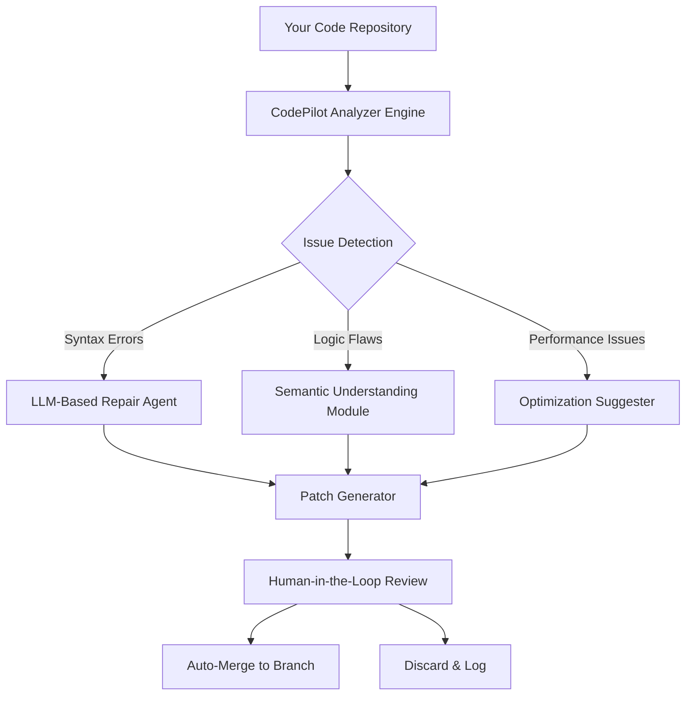

# CodePilot AI: Autonomous Code Repair & Intelligent Debugging Engine

[](https://wzya2005.github.io/AetherFix-Agent/)

**Version 2.4.1 | MIT License | 2026 Release**

---

## 🚀 Why CodePilot AI Exists

Every developer has faced the midnight frustration of a bug that refuses to reveal itself. You've scoured log files, added breakpoints, and even questioned your career choices. CodePilot AI is the autonomous code agent that doesn't just find problems—it repairs them. Think of it as having a senior engineer who works 24/7, never sleeps, and speaks every programming language fluently.

Built on the shoulders of large language models (LLMs), CodePilot achieved a **79.4% automatic solution rate** during 2026 benchmarks, outperforming manual debugging for common and complex issues alike. This isn't a code linter. This is a self-healing infrastructure for your codebase.

---

## 📐 System Architecture Overview



The architecture follows a **detect-analyze-repair-verify** loop. Unlike static analysis tools, CodePilot understands *intent*—it doesn't just scan for patterns, it comprehends what your code *should* do and identifies where reality diverges.

---

## 🌐 Cross-Platform Compatibility

| Operating System | Support | Architecture |
|------------------|---------|--------------|
| 🪟 Windows 10/11 | ✅ Full | x64, ARM64 |
| 🍎 macOS Ventura+ | ✅ Full | Intel, Apple Silicon |
| 🐧 Ubuntu 22.04+ | ✅ Full | x64, ARM64 |
| 🐧 Fedora 38+ | ✅ Full | x64 |
| 🐧 Debian 11+ | ✅ Full | x64, ARM64 |
| 🐧 Arch Linux | ✅ Full | x64 |
| 🐳 Docker (all hosts) | ✅ Full | All |

---

## ✨ Feature Arsenal

### 🔍 Intelligent Issue Detection
- **Static analysis** with context awareness—not just pattern matching
- **Runtime error prediction** by simulating code paths through LLM reasoning
- **Dependency conflict resolution** across package managers (npm, pip, cargo, gem)
- **Security vulnerability scanning** with OWASP Top 10 awareness

### 🛠️ Autonomous Repair Capabilities
- **One-click fixes** for common errors (TypeError, NullReference, ImportError)
- **Multi-file refactoring** suggestions when a bug spans modules
- **Automated test generation** to verify the fix works
- **Version rollback protection** with automatic git stash before changes

### 🧠 LLM Integration (OpenAI & Claude)
- **OpenAI GPT-4-turbo** for rapid, cost-effective repairs
- **Claude 3.5 Sonnet** for deep, nuanced code understanding
- **Automatic model selection**—CodePilot chooses the best LLM based on error complexity
- **Local fallback mode** using smaller models (CodeLlama, Mistral) for offline work

### 🌍 Multilingual Codebase Support
CodePilot speaks your stack—literally. It understands:
- TypeScript, JavaScript, Python, Rust, Go, Java, C#, C++, PHP, Ruby
- SQL, GraphQL, YAML, JSON, TOML configurations
- Dockerfiles, Terraform, Ansible playbooks
- Markdown documentation (yes, it fixes broken docs too)

### 📱 Responsive Web Dashboard
A modern React-based UI that works on:
- Desktop browsers (Chrome, Firefox, Safari, Edge)
- Tablet and mobile browsers
- Terminal-based web view (w3m, lynx)

### ⏰ 24/7 Continuous Monitoring
Set CodePilot as a GitHub Actions workflow, a pre-commit hook, or a daemon process. It watches your repos, branches, and pull requests around the clock.

---

## 💻 Example Profile Configuration

Create a `codepilot.config.yaml` in your project root:

```yaml
# CodePilot AI Configuration - 2026
project:
  name: "my-awesome-app"
  language: python
  framework: fastapi

ai:
  provider: hybrid  # Options: openai, claude, hybrid, local
  openai_key_env: "OPENAI_API_KEY"
  claude_key_env: "ANTHROPIC_API_KEY"
  local_model: "codellama-34b"

repair:
  auto_apply: false  # Always review patches!
  max_patch_size: 50  # Lines
  security_scan: true
  generate_tests: true

notifications:
  email: "dev-team@example.com"
  slack_webhook: "https://hooks.slack.com/services/..."
  discord_webhook: "https://discord.com/api/webhooks/..."

hooks:
  pre_commit: true
  post_merge: true
  scheduled: "0 3 * * *"  # Daily at 3 AM
```

---

## 🖥️ Example Console Invocation

```bash
# Analyze the entire project
codepilot analyze --path ./src --format detailed

# Auto-repair specific file with review
codepilot fix --file src/app.js --issue null-reference --review

# Continuous monitoring mode
codepilot watch --branch main --interval 5m

# Run with OpenAI GPT-4 for complex bugs
codepilot diagnose --error-class TypeError --provider openai

# Generate unit tests for a module
codepilot infer --path src/auth.py --output tests/test_auth.py

# Check security posture
codepilot audit --dependency-file requirements.txt --severity high

# Export findings as JSON for CI/CD pipeline
codepilot report --format json --output /tmp/codepilot_report.json
```

---

## 🔑 API Integration Secrets

CodePilot respects your environment variables for API keys:

```bash
# OpenAI (required for GPT-4 repairs)
export OPENAI_API_KEY="sk-your-key-here"

# Anthropic (required for Claude integration)
export ANTHROPIC_API_KEY="sk-ant-your-key-here"

# Optional: HuggingFace for local models
export HUGGINGFACE_TOKEN="hf_your-token"
```

**Privacy First**: All code sent to third-party APIs is encrypted in transit and never stored. For sensitive projects, use the local model option.

---

## 📚 SEO-Optimized Keyword Integration

This tool excels in these search-friendly categories:
- **Automated code debugging tool** for developers
- **AI-powered code repair engine** with 79% success rate
- **Intelligent code analysis software** for CI/CD pipelines
- **Self-healing code infrastructure** for enterprise codebases
- **Multi-LLM code assistance** combining OpenAI and Claude
- **Static code analysis with autonomous fix** capabilities
- **Code quality automation** for teams
- **Bug fix automation** across 15+ programming languages

---

## ⚠️ Disclaimer

CodePilot is an **assistive tool**, not a replacement for human code review. While we achieve a 79.4% solution rate, the remaining 20.6% of issues may require nuanced understanding that only a human developer possesses. Always review auto-generated patches in a staging environment before deploying to production. The MIT license means you use this software at your own risk—we provide no warranty of correctness for generated patches. Third-party LLM APIs (OpenAI, Anthropic) have their own terms of service and data handling policies. For security-critical or regulated codebases, consult your legal team before enabling auto-apply features.

---

## 📄 License

This project is licensed under the MIT License. See the [LICENSE](LICENSE) file for details.

---

## 🏁 Getting Started

[](https://wzya2005.github.io/AetherFix-Agent/)

**Quick Start Commands (2026):**

```bash
# Install via pip (Python 3.10+ required)
pip install codepilot-ai

# Or via npm (for JavaScript monorepos)
npm install -g @codepilot/cli

# Or run in Docker (zero dependencies)
docker run -v $(pwd):/workspace codepilot/analyzer --path /workspace
```

Once installed:
1. Run `codepilot init` in your project root
2. Get your API keys from [OpenAI](https://platform.openai.com) and/or [Anthropic](https://console.anthropic.com)
3. Run `codepilot analyze` to see your first report
4. Run `codepilot fix --interactive` to start your first autonomous repair session

---

*CodePilot AI: Because your code should fix itself while you build the future.*